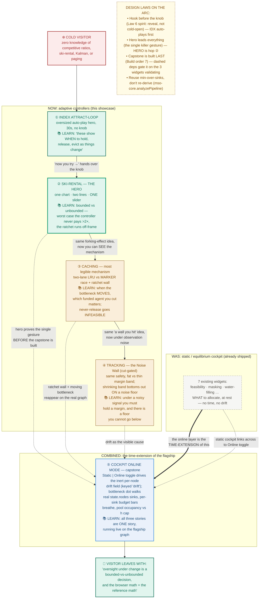
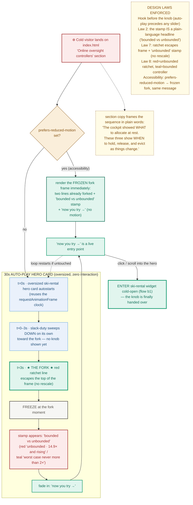

# LAYER 1 — Interaction Flowcharts

Adaptive review cockpit showcase. Three standalone widgets (ski-rental hero, caching, tracking) + index attract-loop + cockpit Online capstone, all powered by `web/adaptive-online.js` (literal port of `skirental.py` / `caching.py` / `tracking.py`, gated by `tests/test_parity.py` — exact scalars at `|Δ| < 1e-6`; the asymptotic caching anchors compared as a finite-sample convergence band, see Build-fidelity notes). Every flowchart is annotated with the specific design law it enforces.

**Color legend (locked across all surfaces):** **teal** = feasible / held-correctly / hit / funded · **amber** = margin / holding-overhead · **red** = refund / miss / infeasible / breach · **blue** = online estimate · **dashed-grey** = offline optimum / analytic floor / asymptotic reference.

**Two distinct overlay objects (used in caching and the theory reveals):** an **anchor tick** is a faint mark the *live empirical* curve lands on at the simulated stream length (e.g. MARKER `3.88` at h=32, rounds=400, mean over 8 seeds); an **asymptotic reference** is a dashed-grey analytic line the curve only *approaches* as the stream lengthens (e.g. the harmonic number `H_h` → `4.06` at h=32). They are never the same line, and the reveal draws both.

**Worst-case framing (used wherever a competitive-ratio number is headline-facing):** every "k× a perfect oracle" number is a **worst-case / adversarial** guarantee — the cost against a stream engineered to defeat the policy, not the typical-case cost. On benign streams the online policy is far better. This qualifier is glossed at first use and restated in each "see the theory" reveal; the ski-rental "never more than 2×" is already a correct worst-case statement and is left as-is.

---

## (a) Cross-widget NARRATIVE-ARC flowchart

Where a cold visitor enters, the static→online→combined story, and the ONE thing they learn at each hop. The cold entry point is the index attract-loop (auto-playing hero); the hero gesture is ski-rental; the capstone re-uses, never re-derives, `mso-core.analyzePipeline` (min-over-sinks).



**One thing learned per hop:** ① *when*, not *what* · ② *bounded vs unbounded* · ③ *which one you cut* · ④ *same safety costs more holding — and there is a floor* · ⑤ *it's all one story, live*.

> **Bottleneck, glossed once for the whole arc** (zero-theory adopter): *the bottleneck is the weakest-link agent that caps delivered quality; under drift it keeps moving, so the controller must keep re-deciding who to watch.* Every later mention ("moving bottleneck", "the bottleneck dot") assumes this one-clause gloss.

---

## (b1) SKI-RENTAL widget (THE HERO) — interaction flowchart

The "try to beat it and fail" loop is central: dragging slack-duty toward `0.003` drives `ratchet_demand`-style holding off-frame while the `2λ` controller stays inside `skirental_ratio = 2 − 1/(2λ)`, hugging the dashed clairvoyant optimum (`opt_slack_cost`). The proven worst-case bound is a ghost tick the viewer keeps bumping into.

**The one visible knob is slack duty, which holds λ = 10 fixed.** So on the cold-open the duty drag traces the ratchet vs the *fixed-λ=10* controller line, landing on the single `1.95` anchor tick. The other three anchors (`1.50` / `1.90` / `1.975`, for λ = 1 / 5 / 20) are reachable only after the user opens the Advanced λ slider — the one knob does **not** sweep all four.

```mermaid
stateDiagram-v2
    direction TB
    [*] --> ColdOpen

    state "COLD-OPEN (on load)" as ColdOpen {
        direction TB
        co1: Headline strip already reads<br/>'worst case never pays more than 2x' (teal)<br/>vs 'pays MORE and climbing' (red)
        co2: Two lines drawn at a mild duty:<br/>teal 2λ-controller flat on dashed-grey<br/>clairvoyant optimum; red ratchet just above
        co3: Story-number card:<br/>'1.95× the best-possible'<br/>caption '1.0 = matches a perfect oracle · higher = worse'
        co4: EXACTLY ONE visible slider:<br/>slack duty (holds λ=10 fixed), 'Drag this →' callout
        co1 --> co2 --> co3 --> co4
    }

    ColdOpen --> DragDuty: visitor grabs the one slider

    state "DRAG SLACK-DUTY (the one knob, λ=10 fixed)" as DragDuty {
        direction TB
        dd1: duty ↓ toward 0.003
        dd2: recompute LIVE in adaptive-online.js<br/>(dwell_slack_cost vs opt_slack_cost at λ=10)
        dd3: red ratchet line steepens,<br/>climbs toward the top of the frame
        dd4: the fixed-λ=10 controller line lands on the<br/>SINGLE faint anchor tick 1.95 (the other ticks<br/>1.50 / 1.90 / 1.975 are λ-dependent — Advanced only)
        dd1 --> dd2 --> dd3 --> dd4
    }

    DragDuty --> AHA

    state "★ 5-SECOND AHA ★" as AHA {
        direction TB
        aha1: at duty ≈ 0.003 the red ratchet<br/>RUNS OFF THE TOP OF THE FRAME
        aha2: NO axis rescale — it escapes,<br/>stamped 'unbounded · pays 14.9× and rising'
        aha3: teal line stays a flat band on the<br/>dashed optimum — 'pays 1.95×'
        aha1 --> aha2 --> aha3
    }
    note right of AHA
        ★ THE explicit aha node ★
        One cause, two visibly forking effects.
        Bounded-vs-unbounded, pre-verbal, < 3s.
        Law 7: a wall is remembered; '14.9' is not.
    end note

    AHA --> TryBeat

    state "TRY-TO-BEAT-IT LOOP (bumping the bound)" as TryBeat {
        direction TB
        tb1: visitor opens 'Advanced: why exactly 2λ?'<br/>(the 'More controls' disclosure)
        tb2: nudges dwell-override above / below 2λ,<br/>and/or sweeps λ ∈ {1,5,10,20} to visit<br/>the 1.50 / 1.90 / 1.95 / 1.975 ticks
        tb3: worst-case ratio gets WORSE either way<br/>(over-hold churns; under-hold re-pays)
        tb4: ghost tick at 2 − 1/(2λ) sits just<br/>above the optimum — can approach, never cross
        tb1 --> tb2 --> tb3 --> tb4
        tb4 --> tb2: 'try another dwell / λ' (fails again)
    }
    note left of TryBeat
        Adversary probe = adversarial slack length
        (worst_case_ratio over τ∈[1,1000]).
        Proven worst-case bound = the floor you keep hitting.
    end note

    TryBeat --> Reset: 'reset to 2λ'
    Reset --> ColdOpen

    note right of ColdOpen
        LAWS ENFORCED HERE
        Law 1: exactly ONE visible slider (slack duty); λ, dwell,
               K-sinks collapse behind 'Advanced: why exactly 2λ?'
        Law 2: plain-language headline strip above the chart
        Law 3: direction printed on the number
               ('1.0 = oracle · higher = worse')
        Law 4: ONE big story-number card; demote the rest
        Law 7: let the failing line escape, stamp 'unbounded'
        Law 8: teal=controller/optimum-hug, red=ratchet,
               dashed-grey=clairvoyant optimum
    end note
```

---

## (b2) CACHING widget (Cache Eviction Race + Ratchet Wall) — interaction flowchart

One slider = pool size `h`. Two lanes only (`lru_misses` vs `marker_misses`) on the **same** `cyclic_adversary` stream + seed; Belady (`belady_misses`) is a dashed yardstick number, not a lane. The ratchet wall (`ratchet_demand` > `h`) is its OWN beat → `INFEASIBLE`. The "try to beat it" loop is the cyclic adversary forcing **worst-case** `Θ(h)` on LRU. The cold race is purely visual (flash-density); the quantitative anchor-vs-live overlay lives in the "see the theory" reveal, not at the aha beat.

```mermaid
flowchart TD
    START["COLD-OPEN (on load)"]:::open --> CO

    subgraph CO["first 5 seconds"]
        direction TB
        co1["Headline strip:<br/>'against a worst-case stream, drop-longest-ago<br/>misses ~h× as often as a cheater who knows<br/>the future' (words first)"]:::headline
        co2["TWO lanes only — LRU vs MARKER —<br/>walking the SAME cyclic-adversary stream + seed.<br/>Belady (the clairvoyant cheater) = a single<br/>dashed-grey yardstick number, not a lane"]:::neutral
        co3["Inline glosses on first use:<br/>'review pool = how many you can watch at once' ·<br/>'LRU = drop whatever you watched longest ago' ·<br/>'clairvoyant / Belady = a cheater who already<br/>knows the future' · 'worst case = a stream<br/>engineered to defeat the pool'"]:::gloss
        co4["ONE visible slider: pool size h<br/>(lanes / seed / policy behind 'More controls')"]:::knob
        co1 --> co2 --> co3 --> co4
    end

    CO --> PLAY["▶ Play / Step the request stream<br/>(reuses the rAF token clock + 'playing' flag<br/>from token-sim.html)"]:::play

    PLAY --> RACE

    subgraph RACE["THE RACE (per request, two lanes — PURELY VISUAL)"]
        direction TB
        r1["travelling spotlight walks the<br/>moving bottleneck across k sink chips<br/>(bottleneck = weakest-link agent that<br/>caps delivered quality)"]:::neutral
        r2{"is the requested sink<br/>currently funded?"}:::decision
        r3["HIT — teal pulse"]:::hit
        r4["MISS — red flash + eviction animation"]:::miss
        r5["LRU visibly evicts the very slot<br/>requested NEXT; MARKER dodges it"]:::miss
        r1 --> r2
        r2 -->|yes| r3
        r2 -->|no| r4 --> r5
    end

    RACE --> AHA["★ 5-SECOND AHA ★ (ONE thing to watch)<br/>LRU's red flashes pile up while MARKER stays mostly teal —<br/>'against this worst-case stream, drop-longest-ago pays ~h,<br/>the randomized policy pays ~log h'<br/>read as FLASH-DENSITY, not a number"]:::aha

    AHA --> ADV

    subgraph ADV["ADVERSARY PROBE = cyclic adversary (try to beat it)"]
        direction TB
        a1["request h+1 distinct sinks into a pool of h<br/>(cyclic_adversary(h, rounds))"]:::neutral
        a2["LRU misses EVERY request — forced worst-case<br/>Θ(h); no h you pick escapes it"]:::miss
        a3["raise h with the one slider to 'win' →<br/>adversary just adds one more sink"]:::miss
        a1 --> a2 --> a3
        a3 --> a1
    end

    AHA --> WALL

    subgraph WALL["RATCHET WALL — its OWN beat"]
        direction TB
        w1["held-slot stack grows as distinct sinks<br/>are seen (ratchet_demand = #distinct)"]:::neutral
        w2{"distinct sinks > h ?"}:::decision
        w3["stack crosses the hard red 'pool capacity h' line"]:::miss
        w4["stamp INFEASIBLE — never-release<br/>would hold > C and cannot"]:::infeasible
        w1 --> w2
        w2 -->|no| w1
        w2 -->|yes| w3 --> w4
    end

    ADV --> REVEAL
    WALL --> REVEAL

    REVEAL["'See the theory: misses vs pool h' REVEAL (opt-in, NOT cold-open)<br/>• LRU≈h line vs MARKER curve<br/>• MARKER is O(log h) / ~H_h ASYMPTOTICALLY (worst-case-competitive):<br/>  dashed-grey H_h asymptote {2.08, 2.72, 3.38, 4.06}<br/>• live EMPIRICAL miss-ratio dots land on the finite-sample anchors<br/>  LRU {2:1.99…8:7.76} ~h · MARKER {4:2.06,8:2.68,16:3.28,32:3.88}<br/>  (rounds=400, mean/8 seeds; these sit BELOW H_h, approaching it as rounds→∞)"]:::reveal

    REVEAL -.->|collapse| CO

    LAW["DESIGN LAWS ENFORCED<br/>Law 1: ONE slider (h); lanes/seed/policy behind 'More controls'<br/>Law 2: plain-language headline strip (with 'worst-case' qualifier)<br/>Law 5: jargon glossed inline (bottleneck, LRU, Belady, clairvoyant, worst case); chips not 'pages'<br/>Law 6: CR-vs-h chart is a REVEAL; the empirical anchor overlay lives HERE, not at the aha<br/>Law 7: ratchet wall stamps INFEASIBLE (a wall, own beat)<br/>Law 8: teal=hit/funded, red=miss/evict/infeasible, dashed-grey=Belady + H_h asymptote<br/>Critique fixes: 4 lanes → 2; Belady a number not a 4th lane;<br/>  finite-sample anchors ≠ H_h asymptote (two distinct objects);<br/>  aha is flash-density ONLY (dot-convergence demoted to the reveal)"]:::law

    classDef open fill:#f6f6f4,stroke:#54514a,color:#54514a;
    classDef headline fill:#E1F5EE,stroke:#0F6E56,color:#0F6E56,stroke-width:2px;
    classDef gloss fill:#fffbe6,stroke:#854F0B,color:#854F0B,stroke-dasharray:3 3;
    classDef neutral fill:#f6f6f4,stroke:#888780,color:#54514a;
    classDef knob fill:#EAF1FB,stroke:#378ADD,color:#1f4e79,stroke-width:2px;
    classDef play fill:#EAF1FB,stroke:#378ADD,color:#1f4e79;
    classDef decision fill:#FAEEDA,stroke:#854F0B,color:#854F0B;
    classDef hit fill:#E1F5EE,stroke:#1D9E75,color:#0F6E56,stroke-width:2px;
    classDef miss fill:#FCEBEB,stroke:#A32D2D,color:#A32D2D;
    classDef infeasible fill:#FCEBEB,stroke:#A32D2D,color:#A32D2D,stroke-width:3px;
    classDef aha fill:#E1F5EE,stroke:#1D9E75,color:#0F6E56,stroke-width:3px;
    classDef reveal fill:#EAF1FB,stroke:#378ADD,color:#1f4e79,stroke-dasharray:5 3;
    classDef law fill:#fffbe6,stroke:#854F0B,color:#854F0B,stroke-dasharray:3 3;
```



---

## (b3) TRACKING widget (the Noise Wall) — interaction flowchart

> **Re-engineered per the calibration math.** The earlier framing ("Kalman breaches less; a spray of RED is unmistakable") is **false for the calibrated pair**: `z = 2.054 = Φ⁻¹(0.98)` targets *the same* 2% infeasibility for **both** policies by construction, so in a ~120-step window each shows ~2 breach flashes — a speckle, not a wall, and the deadband breaches the same or slightly *less*, not more. The real, genuinely-visible 5-second story is **margin thickness**: for the *same safety*, the naive deadband holds a `z·σ = 0.411` band while Kalman holds `z·√P* = 0.127` — a **3.2× fatter band of pure wasted holding**. That fat-vs-thin band plus the floor wall is the cold-open; red breaches are kept only as a faint secondary texture (claiming nothing about which policy breaches more). Whether this widget ships at all is decided by flow (d), re-run honestly against THIS framing.

The one slider is drift `ν` (driving the floor toward, but never to, zero). `KalmanTracker.feasible_budget` (thin teal band) vs `deadband_margin = z·σ` (fat amber band) on the SAME stream; draw the explicit `noise_floor_per_step = z·√P*` line the shrinking teal band bottoms out ON; lock the floor card with a "can't go lower" stamp.

```mermaid
stateDiagram-v2
    direction TB
    [*] --> ColdOpen

    state "COLD-OPEN (on load) — fat vs thin band IS the story" as ColdOpen {
        direction TB
        c1: Headline strip — 'same safety, 3.2x more wasted holding'<br/>(you can't see the true budget, only a noisy<br/>drifting signal; how big a margin must you hold?)
        c2: ONE chart, ONE true line (dashed-grey) + a noisy blue signal
        c3: TWO bands on the SAME stream, side by side:<br/>naive deadband = FAT amber band (z·σ ≈ 0.411) ·<br/>Kalman = THIN teal band (z·√P* ≈ 0.127)
        c4: explicit horizontal 'noise floor' line drawn (dashed-grey)<br/>at z·√P* — the thin teal band bottoms out ON it
        c5: ONE big floor card 'safety margin you must hold ≈ 0.127'<br/>caption 'higher = more wasted holding · deadband holds 3.2× this'
        c6: EXACTLY ONE visible slider: drift ν<br/>(P*, z·√P*, deadband, penalty → small 'details' row)
        c1 --> c2 --> c3 --> c4 --> c5 --> c6
    }

    ColdOpen --> Play: ▶ Play / Step the stream

    state "RUN BOTH POLICIES ON ONE STREAM" as Play {
        direction TB
        p1: feed each observation to KalmanTracker.feasible_budget()<br/>(thin teal) and to the naive deadband z·σ (fat amber)
        p2: the amber band stays ~3.2× the height of the teal band<br/>for the SAME feasibility target (this is the visible gap)
        p3: faint secondary texture: a rare RED breach-flash on EITHER<br/>band when held b < true r(t) — both target ~2%, so flashes<br/>are sparse and roughly equal (NO 'breaches more' claim)
        p1 --> p2 --> p3
    }

    Play --> AHA

    state "★ 5-SECOND AHA ★ (must read as FAILURE)" as AHA {
        direction TB
        a1: the fat amber band dwarfs the thin teal band —<br/>'the careless policy wastes 3.2× the holding<br/>for no extra safety'
        a2: as ν → 0 the teal margin band SHRINKS and<br/>visibly bottoms out ON the drawn noise-floor line
        a3: floor card locks with a 'can't go lower' stamp<br/>(mirrors the ratchet's INFEASIBLE wall)
        a1 --> a2 --> a3
    }
    note right of AHA
        ★ explicit aha ★ — a fat-vs-thin band gap + a floor wall
        are 5-second events. The OLD '√(νσ) won't print 0.00'
        punchline is a non-event (rejected, flow d); the 'Kalman
        breaches less / spray of red' claim is FALSE for the
        calibrated pair and is dropped (red = faint texture only).
    end note

    AHA --> Probe

    state "ADVERSARY PROBE / try-to-beat-it" as Probe {
        direction TB
        b1: open 'More controls' → shrink the naive policy's margin<br/>BELOW z·σ ('trust the noisy signal more')
        b2: now its RED breaches genuinely spray while Kalman stays clean<br/>— under-margining is the thing that actually fails visibly
        b3: you cannot hold less than z·√P* and stay feasible:<br/>the teal band can touch the floor, never go under
        b4: floor = √(ν·σ)-order line; the wall, not a number
        b1 --> b2 --> b3 --> b4
        b4 --> b2: 'try again' (fails again)
    }
    note left of Probe
        The ONLY way to make red 'spray' is a DELIBERATELY
        under-margined naive policy (margin << z·σ). That is an
        opt-in probe, not the cold-open. The honest cold-open
        story is the band-thickness gap + the floor wall.
    end note

    Probe --> CutGate
    CutGate: ⟶ HANDOFF TO CUT-GATE (flow d):<br/>does fat-vs-thin band + floor wall read as failure in < 5s?
    CutGate --> ColdOpen: if SHIP — reset and replay

    note left of ColdOpen
        LAWS ENFORCED HERE
        Law 1: ONE slider (drift ν); σ + z + under-margin behind 'More controls'
        Law 2: plain-language headline strip ('same safety, 3.2× more holding')
        Law 4: ONE floor card; P*, z·√P*, deadband, penalty → 'details' row
        Law 5: axis 'safety margin you must hold', NOT 'z·σ'
        Law 7: floor line + 'can't go lower' stamp = the wall
        Law 8: teal=Kalman thin band (held-correctly), amber=deadband fat band
               (margin/over-hold), red=breach (faint texture), blue=noisy
               signal, dashed-grey=true line + floor
        CUT-GATE: ship only if the band gap + floor read as failure in < 5s (flow d)
    end note
```

---

## (c) INDEX ATTRACT-LOOP — cold-open / first-5-seconds flow

Pure presentation over `adaptive-online.js` (no new math). Auto-play → freeze at the fork → stamp "bounded vs unbounded" → "now you try". Respects `prefers-reduced-motion`. This is the cold entry from flow (a).



---

## (d) TRACKING CUT-GATE — decision flowchart

The explicit cut-or-keep gate from the spec, **re-run against the corrected framing**. Two framings are rejected up front: (1) the native punchline ("the floor `√(νσ)` never prints 0.00") is an absence-of-collapse non-event; (2) "Kalman breaches less / a spray of red is unmistakable" is **mathematically false** for the calibrated pair (`z = Φ⁻¹(0.98)` targets the same ~2% infeasibility for both policies; the deadband breaches the same or slightly less). The widget ships only if the **honest** reframe — a *fat-vs-thin margin band at equal safety* plus the drawn floor wall — reads as failure in **< 5s**, else it is demoted to a paper figure (NOT shipped as a flat third widget).

```mermaid
flowchart TD
    START["TRACKING module exists & passes parity<br/>(adaptive-online.js ↔ tracking.py, |Δ|<1e-6)"]:::ok

    START --> REJECT1

    REJECT1["❌ REJECT framing #1 (native punchline):<br/>'irreducible floor √(νσ) ticks down but won't print 0.00'<br/>= absence-of-collapse = a NON-EVENT<br/>(reads as nothing, or as 'about to hit zero')"]:::reject

    REJECT1 --> REJECT2

    REJECT2["❌ REJECT framing #2 (breach-count):<br/>'Kalman breaches less · a spray of RED is unmistakable'<br/>= FALSE for the calibrated pair — z=Φ⁻¹(0.98) targets the<br/>SAME ~2% infeasibility for BOTH policies (deadband breaches<br/>the same or slightly LESS); ~2 flashes each = a speckle"]:::reject

    REJECT2 --> REENG

    REENG["RE-ENGINEER to the HONEST visible failure:<br/>• Kalman thin band (z·√P*≈0.127) vs naive deadband<br/>  FAT band (z·σ≈0.411) on the SAME stream, SAME safety<br/>• lead with 'same safety, 3.2× more wasted holding'<br/>• draw the explicit 'noise floor' line the teal band bottoms out ON<br/>• lock the floor card with a 'can't go lower' stamp<br/>• red breaches kept only as faint texture (no 'breaches more' claim)<br/>• an under-margined naive policy (red genuinely sprays) is an<br/>  opt-in PROBE, not the cold-open"]:::reeng

    REENG --> TEST{"★ THE 5-SECOND TEST ★<br/>On a quick look, does the fat-vs-thin<br/>band gap + drawn floor wall<br/>READ AS FAILURE in < 5s?"}:::gate

    TEST -->|"YES — the 3.2× band gap is obvious<br/>and the floor reads as a wall (like INFEASIBLE)"| SHIP
    TEST -->|"NO — the band gap is too subtle /<br/>no felt failure without the under-margin probe"| CUT

    SHIP["✅ SHIP as the third standalone widget<br/>(web/widgets/tracking.html)<br/>→ enters the narrative arc as hop ④<br/>→ included in the index section"]:::ship

    CUT["✂️ CUT from the showcase<br/>→ KEEP as a PAPER FIGURE only<br/>(do NOT ship a flat third widget)<br/>→ arc collapses to ski-rental + caching + capstone"]:::cut

    SHIP --> WHY["Rationale (Law 7): a fat-vs-thin band gap and a floor<br/>wall are 5-second events; a number that won't print 0.00,<br/>and a ~2% breach speckle that doesn't even favour Kalman,<br/>are not."]:::law
    CUT --> WHY

    LAW["GATE EMBODIES<br/>Law 7: prefer a remembered WALL / a visible GAP over an unread number<br/>5-second-test discipline: ship only what reads to a scanning adopter<br/>Honesty: reject any framing the calibration math contradicts<br/>Anti-flight-deck: better to ship 2 sharp widgets than 3 with a flat one"]:::law

    classDef ok fill:#E1F5EE,stroke:#0F6E56,color:#0F6E56;
    classDef reject fill:#FCEBEB,stroke:#A32D2D,color:#A32D2D,stroke-width:2px;
    classDef reeng fill:#FAEEDA,stroke:#854F0B,color:#854F0B;
    classDef gate fill:#EAF1FB,stroke:#378ADD,color:#1f4e79,stroke-width:3px;
    classDef ship fill:#E1F5EE,stroke:#1D9E75,color:#0F6E56,stroke-width:3px;
    classDef cut fill:#FCEBEB,stroke:#A32D2D,color:#A32D2D,stroke-width:3px;
    classDef law fill:#fffbe6,stroke:#854F0B,color:#854F0B,stroke-dasharray:3 3;
```



---

## (e) MASKING A/B governance surface — SCOPE NOTE

**Out of scope for this showcase.** The Masking A/B surface (Agent A: p=0.186, M*=2.7, r*=0.145; Agent B: p=0.228, M*=8.1, r*=0.061) is named by the spec's anonymization guardrails but is **not** one of the five shipped features (ski-rental, caching, tracking, index attract-loop, cockpit Online capstone). It is therefore **not flowcharted or mocked** in this package, and ships **nothing new** here. The "if surfaced" hedge is dropped.

The anonymization guarantee it referenced still holds for the surface that *does* exist today: `web/widgets/masking.html` already computes these numbers **live** via `mso-core` (`sigmaRawFixedPoint` → `sigmaCorrFixedPoint` → `maskingIndex`) and binds **only** `mso-core` — it does **not** import `mso-registry.js` / `mso-priors.js`, which carry real vendor model names (HubSpot, Salesforce, Stripe, Auth0, etc. live in `cockpit.html`'s connector library). So the registry-leak risk is real and the "compute live, never import the registry" rule is the correct guard. **If a future revision ever adds an A/B surface to this showcase**, it MUST: (i) keep labels as bare "Agent A" / "Agent B"; (ii) compute via `mso-core.maskingIndex` / the σ-fixed-point helpers, never a stored lookup; (iii) not import the registry/priors modules; and (iv) carry its own one-visible-slider discipline. It would also need fresh copy (the existing `masking.html` footer references a paper experiment, which the new artifacts must not reproduce).

---

### Build-fidelity notes (cross-cutting, apply to every flow above)

- **One module, parity-gated:** all live numbers in every flow are recomputed in-browser by `web/adaptive-online.js` (UMD, `window.AdaptiveOnline`), a literal port of `skirental.py` / `caching.py` / `tracking.py`, gated by three new `tests/test_parity.py` fixtures. The exact scalars (ski-rental ratios/dwell, tracking `P*`/margins/floor) assert `|Δ| < 1e-6`; the caching CR anchors are **asymptotic**, so that fixture compares **finite-sample convergence** (a band at the simulated stream length), **not** `1e-6` — consistent with LAYER-3's parity §d. Nothing ships on a red gate.
- **Two distinct overlay objects, never conflated** (caching + reveals): the live empirical curve lands on **finite-sample anchor ticks** — LRU `{2:1.99…8:7.76}` (~h) and MARKER `{4:2.06, 8:2.68, 16:3.28, 32:3.88}` at rounds=400, mean over 8 seeds — which sit **below** the **asymptotic reference** `H_h` `{2.08, 2.72, 3.38, 4.06}` and only approach it as the stream lengthens. The "see the theory" reveal plots `H_h` as the dashed-grey asymptote and the empirical values as the anchors the live dots hit; MARKER is described as `O(log h)` / `~H_h` **asymptotically** (worst-case-competitive). The "lengthen stream" probe visibly walks the empirical dots up toward the `H_h` asymptote. Other anchors (tracking floor ≈0.127, deadband ≈0.411, penalty ≈3.16) likewise appear only as faint ticks the live module lands on — never hard-coded lookups.
- **Worst-case qualifier on every competitive-ratio claim:** caching headline and reveal say "against a worst-case stream" / "worst case" at first use (`Θ(h)` is the adversarial cyclic-stream ratio; benign streams are far better). Ski-rental's "worst case never more than 2×" is already the correct strong framing and is kept verbatim.
- **Idiom reuse (so these are buildable, not novel):** ski-rental & tracking reuse the `return-operator.html` `<polyline>` time-series idiom + the `requestAnimationFrame(loop)`/`playing`-flag clock (as in `token-sim.html` / `return-operator.html`); caching reuses the `.bar` idiom (`waterfilling.html`) for the held-slot stack and the `.seg` toggle; every "More controls" disclosure is the standard `.sl` slider block collapsed behind a `<details>`/`summary`; the capstone promotes the cockpit's already-present **inert per-node drift field — keyed `drift:` in the connector templates (`cockpit.html` ~L144–193) and surfaced as the `drift_rate` property by the `nd()` node factory (`cockpit.html` L198)** — and reuses `mso-core.analyzePipeline` (min-over-sinks) rather than re-deriving delivered quality. (An implementer greps for `drift:` in the templates, not `drift_rate`.)
- **Caching port pin:** the JS `markerMisses(requests, h, seed=0)` is pinned to **`src/caching.py`** (the package, default `seed=0` form) — *not* `scripts/online_caching.py` (which has no seed default). Keep the seed default = 0 so the fixture and the package agree; resolving the module target this way avoids the missing-default surfacing if anyone wires the fixture to the script.
- **Anonymization (binds to flow a's capstone + the masking scope note in (e)):** widgets carry neutral titles ("Online oversight controllers"), zero author/venue/repo strings; the masking A/B surface (out of scope here per (e)) stays bare "Agent A" / "Agent B" computed live by `mso-core` and **must not** import `mso-registry.js` / `mso-priors.js` (real vendor names).
- **Pre-existing page strings (out of scope, intentionally retained):** the NEW artifacts (`adaptive-online.js`, the three widgets, the new index section, mkdocs nav) carry no author/venue/repo strings. Editing `index.html` / `cockpit.html` leaves their surrounding pre-existing identity strings in place; for a **public OSS cockpit this is in-scope and acceptable** (the spec flags that only a double-blind paper build would need a scrubbed variant). This is an intentional retention, not an oversight; a documented scrub step is needed only if a blind-clean screenshot build is ever required.

**Files referenced (absolute):** spec `/Users/crbazevedo/Documents/papers/minimal-oversight-project/delegation-lab/COCKPIT_ONLINE_SHOWCASE.md`; math `…/src/minimal_oversight/{skirental,caching,tracking,online_control}.py`; UMD pattern `…/web/mso-core.js`; tokens `…/web/theme.css`; idioms `…/web/widgets/{return-operator,waterfilling,token-sim,cockpit,masking}.html` and `…/web/index.html`; parity `…/tests/test_parity.py`. New artifacts these flows specify: `…/web/adaptive-online.js` and `…/web/widgets/{skirental,caching,tracking}.html`.
